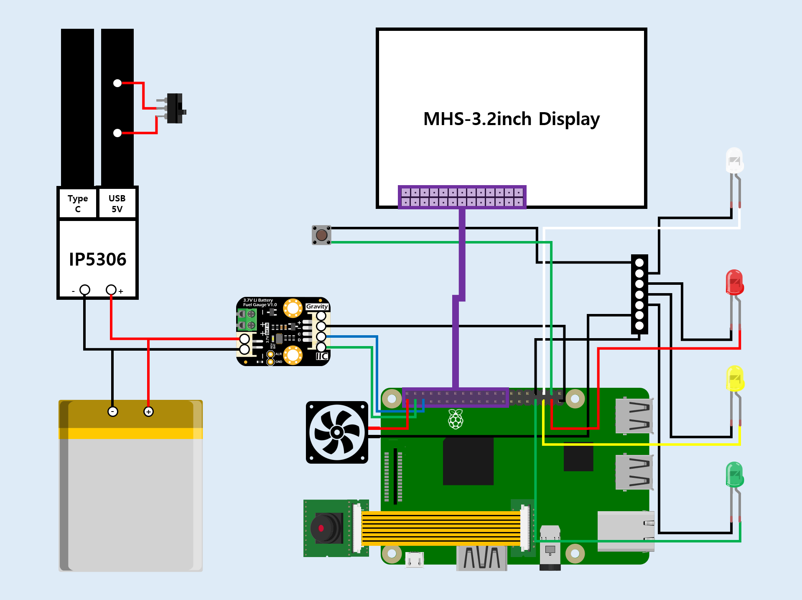
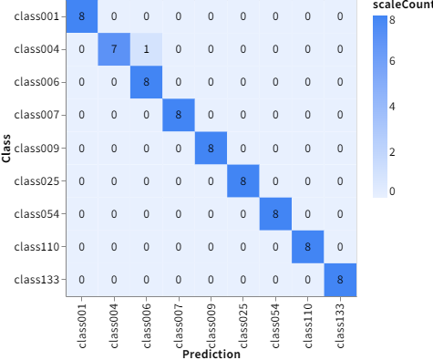
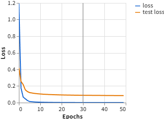
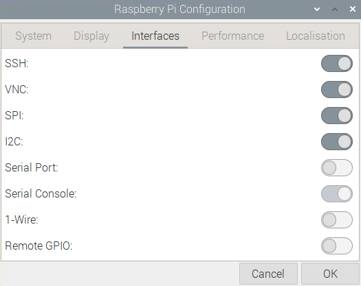

# 포켓몬 트레이너 필수템! 포켓몬 도감 리뷰
<div align="center">
  <a href="https://www.youtube.com/watch?v=Ev5wCygICXk">
    
  </a>
</div>

---

## 1. Hardware Information
- **Main Board:** Raspberry Pi 3 Model B+
    - **Processor:** Broadcom BCM2837B0, Cortex-A53 64-bit SoC @ 1.4GHz
    - **Memory:** 1GB
    - **Storage:** 64GB microSD Card
    - **[Product Brief](./resources/[Raspberry%20Pi%203%20Model%20B+]%20Product%20Brief.pdf)**
- **Display:** MHS 3.2" TFT Touch Display
    - **Resolution:** 320x480
    - **Interface:** SPI
    - **Link:** [https://www.lcdwiki.com/MHS-3.2inch_Display](https://www.lcdwiki.com/MHS-3.2inch_Display)
- **Camera:** Raspberry Pi Camera Module V2 (8MP)
- **Audio**
    - **Speaker:** 3W 4Ω Speaker (Sensitivity 84 dB, Frequency Response 90 Hz - 20 kHz)
    - **Interface:** 3.5mm Jack on Raspberry Pi 3 B+
- **Battery**
    - **Capacity:** 10000mAh (3.7V)
    - **Fuel Gauge:** Gravity 3.7V Li Battery Fuel Gauge SKU DFR0563
        - **Link:** [https://wiki.dfrobot.com/gravity__3.7v_li_battery_fuel_gauge_sku__dfr0563](https://wiki.dfrobot.com/gravity__3.7v_li_battery_fuel_gauge_sku__dfr0563)
    - **Management IC:** IP5306 (Li-ion Charge/Boost Controller)
- **Circuit Diagram**<br>
    


---


## 2. Software Information
- **Operating System:** Raspberry Pi OS with Desktop (32-bit)
    - **Debian Codename:** Bullseye (Version 11)
    - **Download Link:** [https://downloads.raspberrypi.org/raspios_armhf/images/raspios_armhf-2023-05-03/](https://downloads.raspberrypi.org/raspios_armhf/images/raspios_armhf-2023-05-03/)
- **Language & Libraries**
    - 
        -    
- **Machine Learning**
    - **Model**
        - **Type:** Image Classification
        - **Training Environment:** Teachable Machine by Google
            - **Link:** [https://teachablemachine.withgoogle.com](https://teachablemachine.withgoogle.com)
        - **Architecture:** MobileNetV2 (Transfer Learning)
        - **Framework:** TensorFlow Lite (TFLite)
    - **Hyperparameters**
        - **Epochs:** 50
        - **Batch Size:** 16
        - **Learning Rate:** 0.001
    - **Input/Output Details**
        - **Input Size:** 224x224
        - **Input Shape:** (1, 224, 224, 3)
        - **Output Shape:** (1, 9)
    - **Datasets**
        - **Number of Classes:** 9 classes
        - **Images per Class:** 50 images/class
        - **Total Images:** 450 images
        - **Data Split**
            - **Training Set:** 85%
            - **Validation Set:** 15%
        - **Path:** `datasets/`
    - **Confusion Matrix**        
            
    - **Performance Metrics**
        - **Accuracy**<br>
            
        - **Loss**<br>
            
    - **Files Included**
        - **Model File:** `pokedex.tflite`
        - **Labels File:** `labels.txt`
##### ※ This content was created using the AI virtual actor service, Typecast. - Cast: Radio
- **Account Information**
    - **username:** `pokedex`
    - **password:** `0608`


---


## 3. Setup Instructions
### 3.1) Raspberry Pi Configuration
- **Interfaces**    
    
    - **SSH (Secure Shell) Enabled**
    - **VNC (Virtual Network Computing) Enabled**
    - **SPI (Serial Peripheral Interface) Enabled**
    - **I2C (Inter-Integrated Circuit) Enabled**

### 3.2) System Update
- **Update Package List**
    ```bash
    sudo apt update
    ```
- **Upgrade Installed Packages**
    ```bash
    sudo apt upgrade -y
    ```

### 3.3) Display Settings (MHS 3.2" TFT Touch Display)
##### ※ Reference Link: [https://www.lcdwiki.com/MHS-3.2inch_Display](https://www.lcdwiki.com/MHS-3.2inch_Display)
#### 3.3.1) Install Display Driver
- **Clone the Driver Repository**
    ```bash
    git clone https://github.com/goodtft/LCD-show.git
    ```
- **Set Execution Permissions for the Directory**
    ```bash
    chmod -R 755 LCD-show
    ```
- **Navigate to the Driver Directory**
    ```bash
    cd LCD-show/
    ```
- **Install the Driver**
    ```bash
    sudo ./MHS32-show
    ```
#### 3.3.2) Rotate Screen Orientation
- **Navigate to the Driver Directory**
    ```bash
    cd LCD-show/
    ```
- **Execute 180° Rotation Script**
    ```bash
    sudo ./rotate.sh 180
    ```
#### ※ Restore HDMI Output
- **Navigate to the Driver Directory**
    ```bash
    cd LCD-show/
    ```
- **Execute HDMI Restoration Script**
    ```bash
    sudo ./LCD-hdmi
    ```

### 3.4) Install Libraries
#### 3.4.1) System Dependencies and Core Packages (APT)
- **Install Required Packages**
    ```bash
    sudo apt install -y libopenblas0 python3-opencv mpg123
    ```
    - **libopenblas0:** Optimized BLAS (Basic Linear Algebra Subprograms) library for high-performance numerical computing
    - **python3-opencv:** Library of programming functions primarily for real-time computer vision tasks
    - **mpg123:** Fast, console-based MPEG audio player and decoder
#### 3.4.2) Specific Python Modules (pip3)
- **Install Required Python Modules**
    ```bash
    sudo pip3 install smbus2==0.5.0 tflite-runtime==2.13.0 numpy==1.26.4
    ```
    - **smbus2:** Pure Python implementation for I2C protocol communication
    - **tflite-runtime:** Tools to run TensorFlow models efficiently on mobile, embedded, and IoT devices
    - **numpy:** Fundamental package for array computing and numerical operations with Python

### 3.5) Disable GUI (OSD) Warnings
#### 3.5.1) Edit Configuration File
- **Open the file using a text editor**
    ```bash
    sudo vi /boot/config.txt
    ```
    - **/boot/config.txt:** Configuration file for firmware-level hardware initialization and boot options
    - **Add Warning Suppression Option at the end of the file**
        ```diff
        + avoid_warnings=2
        ```
        - `avoid_warnings=1`: Hides the low voltage icon.
        - `avoid_warnings=2`: Hides the icon and all kernel messages.
#### 3.5.2) Apply Changes
- **Apply Changes by Rebooting**
    ```bash
     sudo reboot
    ```

### 3.6) Disable Sleep Mode and Hide Mouse Cursor
#### 3.6.1) Edit Configuration File
- **Open the file using a text editor**
    ```bash
    sudo vi /etc/lightdm/lightdm.conf
    ```
    - **/etc/lightdm/lightdm.conf:** Main configuration file for the LightDM display manager (manages graphical login sessions)
    - **Modify the xserver-command option in the [Seat:*] section (around line 95)**
        ```diff
        - #xserver-command=X
        + xserver-command=X -s 0 -dpms -nocursor
        ```
        - `-s 0`: Disables the screen saver
        - `-dpms`: Disables display power management features
        - `-nocursor`: Hides the mouse cursor
#### 3.6.2) Apply Changes
- **Apply Changes by Rebooting**
    ```bash
     sudo reboot
    ```

### 3.7) Auto-start Application on Boot
#### 3.7.1) Create Service File
- **Open the file using a text editor**
    ```bash
    sudo vi /etc/systemd/system/pokedex.service
    ```
    - **/etc/systemd/system/pokedex.service:** Systemd service file to configure the Pokedex application to start automatically on boot
    - **Add the following content**
        ```ini
        [Unit]
        Description=Pokedex Application
        Wants=graphical.target
        After=graphical.target
        
        [Service]
        User=pokedex
        Group=pokedex
        Type=simple
        WorkingDirectory=/home/pokedex
        Environment="DISPLAY=:0"
        Environment="XDG_RUNTIME_DIR=/run/user/1000"
        ExecStart=/usr/bin/python3 /home/pokedex/main.py
        Restart=on-failure
        RestartSec=5

        [Install]
        WantedBy=graphical.target
        ```
        - **[Unit] Section**
            - `Description`: Brief description of the service
            - `Wants`: Specifies the target that this service wants to be started with
            - `After`: Specifies the order in which units are started
        - **[Service] Section**
            - `User`: User to run the service as
            - `Group`: Group to run the service as
            - `Type`: Specifies the process start-up type
            - `WorkingDirectory`: Directory where the service will run
            - `Environment`: Sets environment variables for the service
            - `ExecStart`: Command to start the service
            - `Restart`: Defines the restart behavior on failure
            - `RestartSec`: Delay before restarting the service
        - **[Install] Section**
            - `WantedBy`: Specifies the target that this service should be started under
#### 3.7.2) Enable the Service
- **Reload Systemd Daemon**
    ```bash
    sudo systemctl daemon-reload
    ``` 
- **Enable the service to start on boot**
    ```bash
    sudo systemctl enable pokedex.service
    ```
- **Start the service immediately**
    ```bash
    sudo systemctl start pokedex.service
    ```
- **Check the status of the service**
    ```bash
    sudo systemctl status pokedex.service
    ```
#### 3.7.3) Apply Changes
- **Apply Changes by Rebooting**
    ```bash
     sudo reboot
    ```


---


## ※ Registered Pokemon
| CLASS | POKEMON | DESCRIPTION |
| :---: | :---: | :--- |
| `class001` | 이상해씨(Bulbasaur) | 태어나서 얼마 동안 등의 씨앗에 담긴 영양을 섭취하며 자란다. |
| `class004` | 파이리(Charmander) | 꼬리에서 타오르는 불꽃은 생명력의 상징. 기운이 없으면 불꽃이 약해진다. |
| `class006` | 리자몽(Charizard) | 정말 화가 난 리자몽의 꼬리 끝 불꽃은 푸르스름하게 불타오른다. |
| `class007` | 꼬부기(Squirtle) | 태어난 뒤 등이 부풀면서 단단한 등껍질이 생긴다. 입에서 강력한 거품을 발사한다. |
| `class009` | 거북왕(Blastoise) | 분사한 물의 기세에 밀리지 않도록 일부러 체중을 무겁게 불리고 있다. |
| `class025` | 피카츄(Pikachu) | 양 볼에는 전기를 저장하는 주머니가 있다. 화가 나면 저장한 전기를 단숨에 방출한다. |
| `class054` | 고라파덕(Psyduck) | 항상 두통에 시달리고 있다. 이 두통이 심해지면 이상한 힘을 쓰기 시작한다. |
| `class110` | 또도가스(Weezing) | 체내에 들어 있는 독가스의 농도를 극한까지 낮추면 최고급의 향수가 된다. |
| `class133` | 이브이(Eevee) | 환경 변화에 곧바로 적응할 수 있도록 여러 형태로 진화할 수 있는 가능성을 가지고 있다. |
- **Link:** [https://www.pokemonkorea.co.kr/pokedex](https://www.pokemonkorea.co.kr/pokedex)